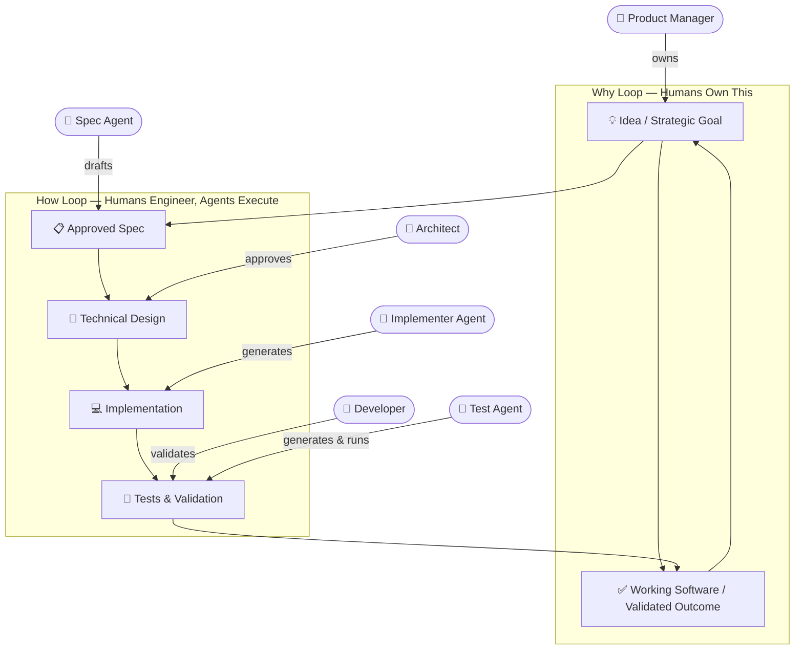

# Vision: Agentic Spec-Driven Software Development Lifecycle Management System

> *"The lingua franca of development moves to a higher level, and code is the last-mile approach."*
> — GitHub Spec-Kit

**Version:** 1.0 | **Date:** April 2026 | **Status:** Living Vision

---

## Executive Summary

We envision an **Agentic Spec-Driven SDLC Management System** (ASDLMS) — a distributed, multi-repo, multi-human, multi-agent platform where **specifications are the primary artifact of software development**, and agents do the heavy lifting of implementation while humans retain ownership of *what* is being built and *why*.

This is not vibe coding. This is not reckless automation. It is a disciplined, industrialized approach to software delivery where humans are **on the loop** — steering, approving, and validating — while agents execute within a carefully engineered harness of standards, templates, and guardrails.

---

## The Core Problem with Today's Approaches

Current spec-driven development tools (Kiro, spec-kit, Tessl) make bold promises but reveal critical gaps when tested against real-world conditions:

- **One-repo thinking**: Every tool is designed for a single codebase, not an enterprise portfolio.
- **Single-human model**: Designed for individual developers, not distributed product teams.
- **Undefined spec lifecycle**: Spec-first is common, but spec-anchored over time is rare; spec-as-source is mostly theoretical.
- **Workflow rigidity**: The same heavyweight workflow is applied to a 3-line bug fix and a 6-month feature — a sledgehammer for every nail.
- **No feedback loops**: Specs are written and forgotten; there is no mechanism to improve the process itself over time.
- **Context overload**: Verbose markdown files replace thinking with bureaucracy, leading to review fatigue and hallucination amplification.
- **Siloed knowledge**: Every team reinvents their harness from scratch. Institutional knowledge is lost between projects and people.

The ASDLMS addresses all of these gaps through a unified, distributed, and self-improving system.

---

## Guiding Principles

1. **Specs as Living Source of Truth** — A spec is not documentation. It is the authoritative description of intended behavior that outlives any particular implementation. Code is the current realization of the spec, not the other way around.
2. **Humans Own the Why, Agents Own the How** — Humans are responsible for product vision, high-level architecture, strategic planning, acceptance validation, and ethical judgment. Agents handle research, design elaboration, code generation, testing, refactoring, and documentation.
3. **The Agentic Flywheel** — Every agent execution produces signals. Those signals feed back into the harness. The harness improves. The improvements compound. Over time, the system becomes progressively more autonomous in areas where it has proven trustworthy.
4. **Standardization Enables Scale** — A shared, versioned registry of templates, skills, agents, and MCP tools means every team and every repo starts from institutional best practice — not from zero.
5. **Progressive Trust** — Autonomy levels are earned, not assumed. New agents, new repos, and new contributors start with high oversight. Trust is extended incrementally as track records are established.

---

## Human-Agent Collaboration Model

---

## Document Map

This vision is organized into focused sub-documents — each covering one aspect of the ASDLMS in depth. Open them in the **Spec Documents** section of the SPLM sidebar.

| # | Document | What it covers |
|---|----------|----------------|
| 1 | **Architecture: Platform Registry & The Harness** | Four-layer system overview · Platform Registry (templates, agents, skills, MCP tools) · The Harness (constitution, memory bank, sensors, knowledge agents) · Distributed Standards & Registry Model |
| 2 | **Architecture: SPLM Control Plane** | Unified Backlog · Spec as Primary Artifact lifecycle · Multi-Level Planning · Agent Orchestration · Shared Views · Multi-Repo Architecture |
| 3 | **Workflows** | Standard Feature Lifecycle (10-gate process) · Bug Fix Nano Workflow · Workflow tiers by size · Spec Lifecycle & Evolution |
| 4 | **Governance, Roles & Security** | Human role boundaries & authority matrix · Security model (least privilege, audit trail, prompt injection defense) · Multi-Human collaboration patterns |
| 5 | **The Agentic Flywheel** | Feedback loop design · Four trust phases · Signal collection taxonomy · Continuous harness improvement · Success metrics |
| 6 | **Best Practices & Getting Started** | Role-specific best practices · Anti-patterns to avoid · Technology stack guidance · 12-week adoption roadmap · The future of spec-as-source |

---

*This is a living vision document. Use `propose_spec_change` in the SPLM sidebar to suggest edits to any document in this series.*
