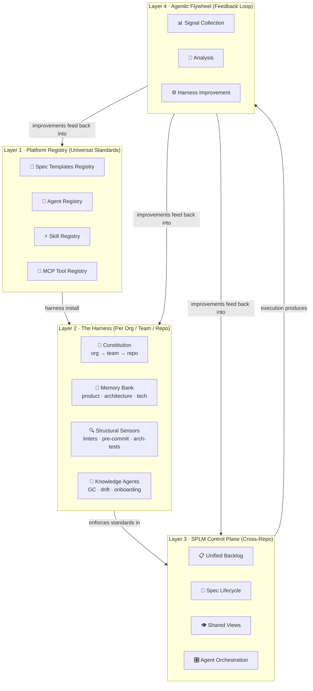

# Vision: ASDLMS Architecture — Platform Registry & The Harness

> Part of the [ASDLMS Vision Series](/). This document covers Layers 1 & 2: the Platform Registry that provides universal standards, and The Harness that instantiates those standards per organization, team, and repository.

**Version:** 1.0 | **Date:** April 2026 | **Status:** Living Vision

---

## System Architecture Overview

The ASDLMS is organized into four interconnected layers, each building on the one beneath it:



---

## Multi-Repo Federated Architecture

A single product may span dozens of repositories. The Platform Registry distributes universal standards to every repo via the SPLM Control Plane:

```mermaid
graph TB
    REG[("🏛️ Platform Registry\nversioned artifacts")]

    subgraph CTRL["SPLM Control Plane"]
        BACKLOG["Unified Backlog"]
        SPECS["Cross-Repo Specs"]
        VIEWS["Shared Views"]
    end

    subgraph RepoAPI["Repo: API Service"]
        CON1["constitution.md"]
        SPEC1["specs/"]
        AG1["AGENTS.md"]
    end

    subgraph RepoWeb["Repo: Web App"]
        CON2["constitution.md"]
        SPEC2["specs/"]
        AG2["AGENTS.md"]
    end

    subgraph RepoMobile["Repo: Mobile"]
        CON3["constitution.md"]
        SPEC3["specs/"]
        AG3["AGENTS.md"]
    end

    REG -->|"templates · skills · agents"| RepoAPI
    REG -->|"templates · skills · agents"| RepoWeb
    REG -->|"templates · skills · agents"| RepoMobile
    REG --> CTRL
    CTRL --> RepoAPI
    CTRL --> RepoWeb
    CTRL --> RepoMobile

    PM(["👤 Product Manager"]) --> BACKLOG
    ARCH(["👤 Architect"]) --> SPECS
    TL1(["👤 Tech Lead"]) --> RepoAPI
    TL2(["👤 Tech Lead"]) --> RepoWeb
```



---

## Layer 1: The Platform Registry (Universal Standards)

A versioned, distributed registry — think of it as an NPM or package registry, but for the building blocks of the development process itself.

**Spec Templates Registry**
- Versioned templates for features, bugs, architecture decisions, RFCs, data models, API contracts, and runbooks.
- Templates are tiered by problem size: `nano` (bug fix), `micro` (small feature), `standard` (story), `macro` (epic), `strategic` (roadmap item).
- Templates enforce separation of *functional intent* from *technical implementation*.
- Templates are authored, reviewed, and published by platform teams; consumed by product teams.

**Agent Registry**
- Named, versioned agent definitions: `spec-writer`, `architect`, `implementer`, `reviewer`, `test-generator`, `doc-writer`, `gc-agent` (garbage collection).
- Each agent definition includes: purpose, trigger conditions, context requirements, tool access, autonomy level, and output contracts.
- Agents are composable: the `standard-feature` workflow orchestrates multiple agents in sequence.

**Skill Registry**
- Portable, reusable skills: e.g., `react-component-conventions`, `database-migration-patterns`, `api-design-guidelines`, `security-review`.
- Skills are lazy-loaded by agents on demand, reducing context pollution.
- Skills are contributed by teams and curated by the platform guild.

**MCP Tool Registry**
- Standard MCP server definitions for: issue trackers, CI pipelines, observability platforms, code search, dependency analysis, browser automation, and data access.
- Each tool definition includes security posture, capability scope, and rate limits.
- New tools undergo security review before registry admission (OWASP compliance required).

---

## Layer 2: The Harness (Per Organization / Team / Repo)

Derived from the Platform Registry, customized for context. The harness is the set of all guides and sensors that govern agent behavior within a specific context.

**Constitution (`constitution.md`)**

The constitution is the non-negotiable foundation. It contains architectural principles, security requirements, coding standards, and compliance rules that apply to every change in the codebase — regardless of feature, author, or agent.

A constitution is inherited and layered:
- `org/constitution.md` — Organization-wide, authored by Principal Architects
- `team/constitution.md` — Team-specific extensions
- `repo/constitution.md` — Repo-specific constraints

Agents must evaluate every output against the applicable constitution layers before completing a task.

**Memory Bank**
- `product.md` — Business context, user personas, key outcomes
- `architecture.md` — Current architectural state, key decisions, bounded contexts
- `tech.md` — Technology stack, dependency constraints, patterns in use
- `AGENTS.md` — Agent-specific instructions and context for this repo
- `data-models.md` — Core domain entities and their relationships

**Structural Sensors (Deterministic)**
- Custom linters enforcing architectural boundaries
- Pre-commit hooks: secret scanning, license compliance, format validation
- Structural tests (ArchUnit-style): module boundaries, forbidden dependencies
- CI gate agents: run after every PR to validate spec-code consistency

**Knowledge Agents (Inferential, Periodic)**
- **Garbage Collection Agent**: detects spec drift — finds discrepancies between specs and code, logs them back into the backlog.
- **Architecture Drift Agent**: evaluates codebase against constitution, raises issues.
- **Dependency Health Agent**: identifies outdated or vulnerable dependencies, proposes upgrades.
- **Onboarding Agent**: keeps `architecture.md` and `product.md` accurate as the codebase evolves.

---

## Distributed Standards: The Registry Model

The platform registry functions like a package manager for process artifacts. Versioning, publishing, consuming, and deprecating follow the same patterns engineers already know.

**Version Contract**
```
registry.asdlms.io/templates/standard-feature@2.1.0
registry.asdlms.io/agents/implementer@1.4.2
registry.asdlms.io/skills/react-conventions@3.0.0
registry.asdlms.io/mcp/github-issues@1.2.0
```

**Contribution Model**
- Any team can propose additions to the registry.
- Proposals go through a platform guild review (automated quality checks + human review).
- Approved artifacts are published and semantically versioned.
- Breaking changes require major version bumps and migration guides.

**Consumption**
- Repos declare their registry dependencies in a manifest file (`.asdlms.json` or similar).
- The harness installer resolves and installs the declared artifacts.
- Pinned versions ensure stability; range versions allow rolling updates.

---

*Next: [ASDLMS Architecture — SPLM Control Plane](./02-architecture-splm-control-plane.md)*
