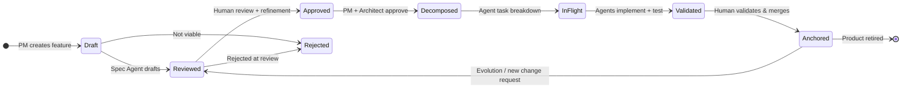
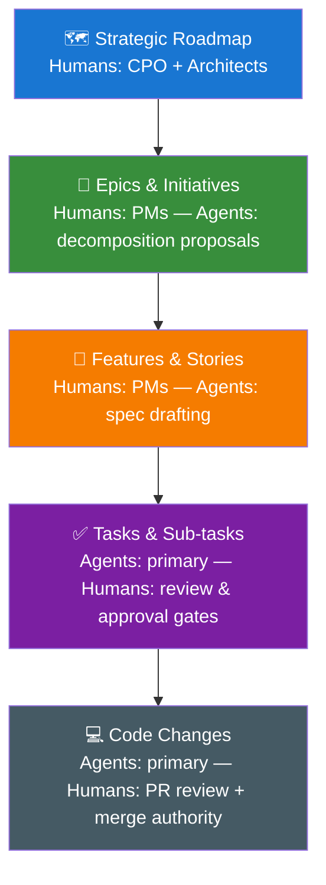

# Vision: ASDLMS Architecture — SPLM Control Plane

> Part of the [ASDLMS Vision Series](/). This document covers Layer 3: the SPLM Control Plane — the shared workspace where humans and agents collaborate across all repositories.

**Version:** 1.0 | **Date:** April 2026 | **Status:** Living Vision

---

## Layer 3: The SPLM Control Plane

The Software Product Lifecycle Management control plane is the shared workspace where humans and agents collaborate across all repos. It provides a unified, cross-repo view of the product's current state and the work in flight.

### Unified Backlog

- All features, bugs, and tasks across all repos are visible in one ranked backlog.
- Items are tagged by repo scope, team, sprint, and status.
- Cross-repo dependencies are explicit and tracked.
- Priority is set by humans (Product Managers); sequencing recommendations are proposed by agents.

---

### Spec as Primary Artifact

Each backlog item has an associated spec document that evolves through its lifecycle:

---

### Multi-Level Planning

---

### Agent Orchestration

The control plane dispatches and coordinates multi-agent workflows:

1. **Spec Agent**: Given a rough feature idea, produces a structured spec using applicable templates.
2. **Decomposition Agent**: Breaks an approved spec into ordered implementation tasks.
3. **Architect Agent**: Proposes technical design, evaluates against constitution, flags risks.
4. **Implementer Agent(s)**: Execute tasks in parallel across repos where possible.
5. **Test Agent**: Generates and runs tests against acceptance criteria in the spec.
6. **Review Agent**: Independent context, assesses implementation quality against spec and constitution.
7. **Doc Agent**: Updates memory bank documents, changelogs, and public documentation.
8. **Validation Agent**: Confirms spec-code alignment, closes the loop for the human approver.

---

### Shared Views

| View | Primary Audience | Description |
|------|-----------------|-------------|
| Product Board | Product Managers | Features by status, priority, and roadmap alignment |
| Agent Activity | Tech Leads | Real-time feed of all agent actions across repos |
| Spec Explorer | All | Browse and search all specs; view history and evolution |
| Cross-Repo Impact | Architects | See how a spec change propagates across repos |
| Trust Dashboard | Engineering Leadership | Autonomy levels, human intervention rates, agent quality scores |
| Backlog Planner | Product + Tech | Ranked, cross-repo backlog with effort and risk scores |
| Compliance View | Security / Compliance | Constitution violation history, remediation status |

---

## Multi-Repo Architecture

### Cross-Repo Specifications

Some specs span multiple repos (e.g., a new API endpoint requires changes to the API repo, web repo, mobile repo, and documentation repo). These are **cross-repo specs** managed at the SPLM level:

- A single parent spec defines the full intent.
- Child specs are auto-generated for each affected repo, inheriting from the parent.
- Child spec execution is orchestrated; agents coordinate across repos with dependency awareness.
- Cross-repo impact analysis runs before any approval gate.

### Federated Constitution

The constitution is hierarchical. Org-wide rules cascade down, team rules add constraints, repo rules specialize further. No lower layer can contradict a higher layer — constitution conflict detection is automated.

### Distributed Harness Inheritance

When the platform publishes an update to a shared template or skill:
- A "Harness Update" notification is posted to affected repos.
- A human (Tech Lead or Platform Engineer) reviews and approves the update adoption.
- The agent can prepare the migration; the human approves the merge.

---

*Next: [ASDLMS Workflows](./03-workflows.md)*
