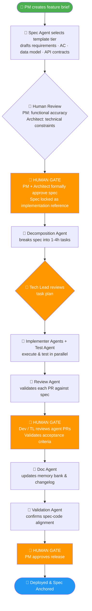
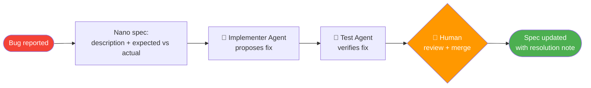

# Vision: ASDLMS Workflows

> Part of the [ASDLMS Vision Series](/). This document covers the standard workflows for features and bugs, and the spec lifecycle & evolution model.

**Version:** 1.0 | **Date:** April 2026 | **Status:** Living Vision

---

## Standard Feature Lifecycle

**Key principle:** Human gates (orange) mark the synchronization points where human judgment is required. All other steps are agent-executable. The spec is the contract at every stage — it does not change after approval unless a formal `propose_spec_change` is submitted.

---

## Bug Fix Lifecycle (Lightweight Nano Workflow)

Not every change warrants an elaborate process. The system scales workflow overhead with problem complexity:

**Workflow tiers:**

| Size | Template | Typical Duration | Human Touchpoints |
|------|----------|-----------------|-------------------|
| `nano` | Bug fix, trivial change | Hours | 1 (review + merge) |
| `micro` | Small isolated feature | 1-2 days | 2 (spec approval + merge) |
| `standard` | Story / full feature | 1-2 weeks | 4 (spec, decomposition, PR, release) |
| `macro` | Epic spanning multiple sprints | 4-12 weeks | Multiple per sub-feature |
| `strategic` | Roadmap initiative | Quarters | Executive + Architecture review |

---

## Spec Lifecycle and Evolution

One of the fundamental failures of today's SDD tools is the lack of a strategy for spec maintenance over time. The ASDLMS defines three explicit modes:

| Mode | When to Use | Spec Fate |
|------|-------------|-----------|
| **Spec-first** | Small changes, one-off fixes | Spec is written for the task, may be archived after |
| **Spec-anchored** | Features that will evolve | Spec is kept alongside code, updated with each change |
| **Spec-as-source** | Stable, well-understood components | Spec is the source of truth; code is regenerated from spec |

### Spec Drift Detection

Over time, code and spec diverge — this is natural. The Garbage Collection Agent runs periodically to find drift and log it as tech debt items in the backlog. Drift is measured, tracked, and addressed in a disciplined way rather than silently accumulating.

### Spec Evolution

When a feature must change:
1. The anchored spec is re-opened.
2. A `propose_spec_change` creates a tracked change (find & replace) against the live spec.
3. The change triggers a new decomposition cycle.
4. Old and new spec versions are retained in history.
5. Code changes trace back to spec change IDs.

---

*Next: [ASDLMS Governance, Roles & Security](./04-governance-security.md)*
