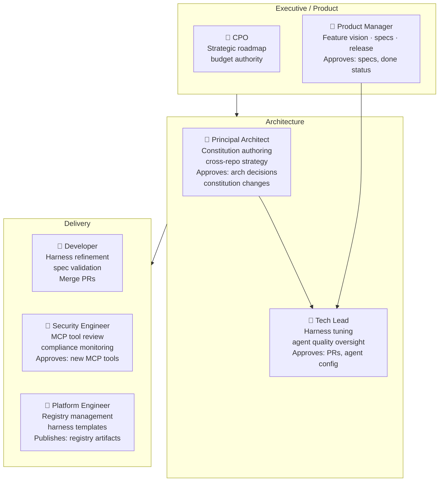

# Vision: ASDLMS Governance, Roles & Security

> Part of the [ASDLMS Vision Series](/). This document covers human roles and authority boundaries, the security model, and multi-human collaboration patterns.

**Version:** 1.0 | **Date:** April 2026 | **Status:** Living Vision

---

## Human Roles and Responsibilities

The ASDLMS is designed to **amplify human judgment**, not replace it. Clear role boundaries prevent both under-involvement (unchecked automation) and over-involvement (humans as bottlenecks).

**Non-delegable human authority — humans always decide:**
- Approving specs before implementation begins
- Releasing to production
- Architectural direction changes
- Constitution amendments
- Cross-repo breaking changes
- Any action with significant irreversibility

---

## Security Model

Security is not an afterthought. It is architecturally embedded at every layer.

### Principle of Least Privilege — Agents

- Each agent has a declared, scoped capability set.
- Agents cannot acquire capabilities beyond their declaration.
- MCP tools have rate limits and are scoped to read/write by resource type.
- Agents cannot push to main branch directly; all changes go through PR review gate.

### Audit Trail

- Every agent action is logged: which spec it acted on, which files it modified, which tools it called.
- Logs are immutable and stored outside agent reach.
- Human approval decisions are cryptographically signed.

### Prompt Injection Defense

- Agent inputs from external sources (issue trackers, PR comments, external APIs) are sanitized before entering the agent context.
- Suspicious input patterns trigger a human review flag before agent execution continues.

### Secret Management

- Agents never have access to secret values directly; they use credential proxies with audit logging.
- Pre-commit hooks enforce no-secrets rules before any commit is allowed.
- Continuous secret scanning runs on merge queue.

### Supply Chain Security

- All registry artifacts are signed and hash-verified on consumption.
- SBOM (Software Bill of Materials) is generated for every release.
- Dependency health agents proactively identify newly-vulnerable packages.

---

## Multi-Human Collaboration Model

### Async-first, Decision-synchronous

Most work proceeds asynchronously — agents execute while humans sleep. Decision gates are the synchronization points where humans must engage. The system does not block indefinitely; escalation paths exist for stalled approvals.

### Conflict Resolution

When multiple humans must approve, and they disagree:
- The system surfaces the conflict explicitly.
- An Architect Agent provides an analysis of both perspectives.
- Escalation follows the org's authority matrix.
- All decisions, including disagreements and resolutions, are recorded in the spec history.

### Presence Signals

Shared views display real-time presence: who is reviewing which spec, which agent is executing which task. This prevents duplication and provides situational awareness across distributed teams.

### Notifications (Pull, not Push)

Humans receive structured digests — not a firehose of events. The system surfaces what requires human attention in priority order. Agents do not spam; they accumulate and summarize.

---

*Next: [The Agentic Flywheel](./05-agentic-flywheel.md)*
