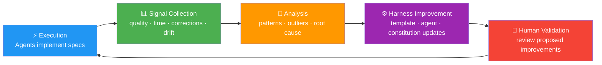
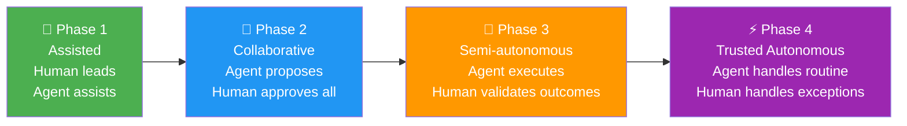

# Vision: The Agentic Flywheel — Feedback & Self-Improvement

> Part of the [ASDLMS Vision Series](/). This document covers Layer 4: the feedback loop that continuously improves the harness, agents, and process based on real execution signals.

**Version:** 1.0 | **Date:** April 2026 | **Status:** Living Vision

---

## Layer 4: The Agentic Flywheel

The flywheel is what makes the system self-improving over time. Every execution produces data. That data feeds back into the platform to make the next cycle faster, safer, and more accurate.

---

### Flywheel Trust Phases

Trust is earned progressively, per agent, per task category. A team may be in Phase 4 for routine bug fixes and Phase 1 for architectural decisions — concurrently.

---

## Signal Collection

The flywheel runs on operational data. Signals collected include:

| Signal | Source | Improvement Use |
|--------|--------|-----------------|
| Spec correction rate | Human edits to agent-drafted specs | Template quality tuning |
| Implementation iteration count | Commits needed before PR approval | Decomposition granularity tuning |
| Spec-code drift frequency | GC Agent reports | Constitution and enforcement strength |
| Human override events | Cases where agents were bypassed | Agent trust calibration |
| Test generation coverage | Test Agent outputs | Test template improvement |
| Review cycle time | Time from PR creation to merge | Workflow orchestration optimization |
| Model failure patterns | Agent errors and retries | Context and prompt engineering |
| Constitution violation frequency | Sensor reports by rule | Constitution clarity improvement |

---

## Continuous Harness Improvement

The flywheel enables several types of automated improvement proposals:

**Template Refinement**: When a spec template consistently requires the same human corrections, the Improvement Agent proposes a template update to incorporate those corrections proactively.

**Constitution Clarification**: When agents repeatedly misinterpret a constitution rule, the Improvement Agent flags the ambiguity and proposes a clearer restatement — with examples.

**Skill Evolution**: When a pattern of agent errors traces back to an out-of-date skill (e.g., a deprecated API pattern still in the `react-conventions` skill), the skill is flagged for update.

**Decomposition Calibration**: When tasks are consistently too large (requiring extensive back-and-forth) or too small (resulting in trivial PR noise), the decomposition heuristics are adjusted.

---

## The Agentic Flywheel in Practice

The flywheel distinguishes good agentic systems from exceptional ones. Most teams will start in Phase 1 or 2. The flywheel is what gets them to Phase 3-4 safely.

**The compounding effect**: The improvements from one sprint reduce friction in the next. Over a year, a team operating the flywheel will have a fundamentally different (and better) experience than a team that installs agents and never iterates on the harness.

**Human-in-the-loop for all improvements**: Every proposed harness improvement is reviewed and approved by a human before it is applied. The system never silently changes its own rules. Transparency is non-negotiable.

**Regression protection**: Improvements are validated by running the previous sprint's specs through the updated harness in simulation. Regressions automatically revert the proposed change.

**The constitutional floor**: Some harness elements are flagged as constitutional — they cannot be changed by the flywheel without a human constitutional amendment. This ensures that security, compliance, and architectural invariants are protected even as the system self-improves.

---

## Success Metrics

Progress toward the ASDLMS vision is measured by observable, quantitative outcomes:

| Metric | Baseline (SDD-naive) | Target (Phase 3) | Target (Phase 4) |
|--------|----------------------|------------------|------------------|
| Spec-to-code cycle time | 2-3 weeks | < 3 days | < 1 day (routing changes) |
| Spec drift rate (after 3 months) | ~80% diverged | < 20% diverged | < 5% diverged |
| Human context switches per feature | ~15-20 | < 5 | < 2 (exceptions only) |
| Test coverage of spec ACs | ~40% | > 80% | > 95% |
| Agent PR approval rate (first attempt) | N/A | > 60% | > 85% |
| Mean time to reproduce a bug | Hours to days | < 30 min | < 10 min |
| Onboarding time to productive PR | 2-4 weeks | < 1 week | < 1 day |
| Cross-repo change coordination overhead | Very high | Low | Automated |

These metrics are tracked on the Trust Dashboard (Layer 3 Shared Views) and inform the flywheel's improvement agenda.

---

*Next: [Best Practices, Anti-Patterns & Getting Started](./06-practices-getting-started.md)*
