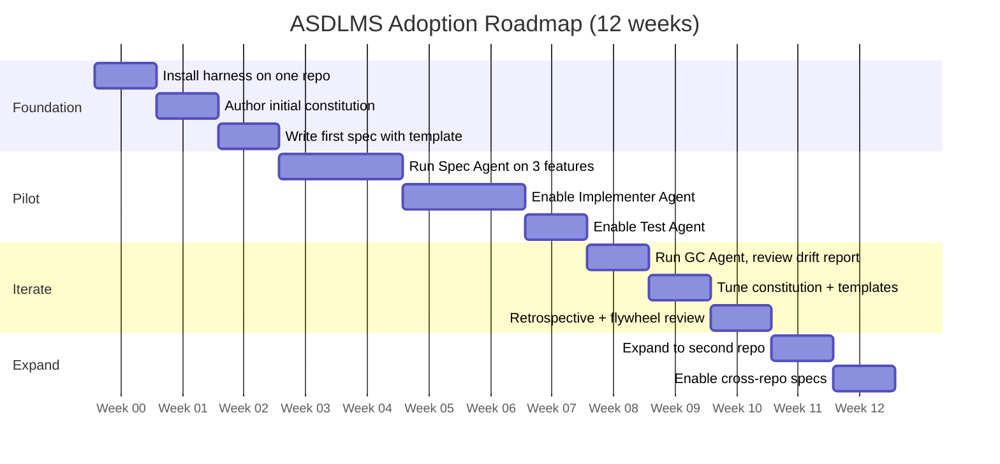

# Vision: Best Practices, Anti-Patterns & Getting Started

> Part of the [ASDLMS Vision Series](/). This document covers best practices by role, common anti-patterns to avoid, technology stack guidance, and an adoption roadmap.

**Version:** 1.0 | **Date:** April 2026 | **Status:** Living Vision

---

## Best Practices

### For Product Managers

- Write feature briefs that focus on **user outcomes, not implementation details**. The agent will propose the how; you focus on the why and the what.
- Treat the spec as a living document, not a one-time artifact. Return to it when requirements shift.
- Participate in spec reviews actively — your corrections train the system.
- Keep acceptance criteria specific and testable. If an AC can't be automated-tested, reconsider it.

### For Architects

- **Author the constitution first.** Agents will make decisions based on it. An ambiguous or absent constitution leads to inconsistent agent behavior.
- Define architectural boundaries as automated tests, not just documents. Sensors enforce what documents only suggest.
- Use the cross-repo impact view before approving any spec that touches shared contracts.
- Invest in the memory bank. Well-maintained `architecture.md` dramatically improves agent output quality.

### For Tech Leads

- Tune the harness incrementally. Start with the default templates and adjust based on what the GC Agent reports.
- Treat agent PR reviews as signal: high correction rates indicate template or skill gaps.
- Set explicit autonomy levels per task category. Don't give agents more scope than you're comfortable validating.
- Run the flywheel discussion in every retrospective. Ask: what did agents struggle with this sprint?

### For Developers

- Trust the spec. If code logic differs from the spec, that's a bug in the spec or the code — either way, it needs resolving.
- When reviewing agent PRs, comment on architectural concerns, not just style. Style is the agent's job.
- Contribute to the skill registry. If you spot an outdated pattern in a skill, raise a registry update.
- Validate locally before merge — the agent can miss non-deterministic test failures.

### For Security Engineers

- Review MCP tool additions to the registry rigorously. A misconfigured tool is the most common vector for agent-induced security incidents.
- Require prompt injection mitigations on any agent that processes external input.
- Use the compliance view to proactively surface constitution violations before they accumulate.
- Ensure every agent action is logged and immutable. If you can't audit it, don't allow it.

---

## Anti-Patterns to Avoid

| Anti-pattern | Description | Why It Fails |
|---|---|---|
| **Agent-first, spec-after** | Building with agents before specs are written | No reference contract; agents produce inconsistent, untested results |
| **Spec-once-never-update** | Writing a spec upfront and ignoring it post-approval | Code diverges; specs become useless; GC Agent generates endless drift tickets |
| **Human rubber-stamping** | Approving agent outputs without meaningful review | Errors compound; trust is misplaced; constitutional violations propagate |
| **Constitution neglect** | Deploying agents with a minimal or absent constitution | Agents make architectural decisions that conflict with each other and the codebase |
| **Monolithic specs** | Writing mega-specs covering hundreds of story points | Agent decomposition quality degrades; testability suffers; human reviewers disengage |
| **Too many agents at once** | Deploying all agent types simultaneously | Cognitive overload; unclear ownership; hard to attribute failures |
| **Ignoring the flywheel** | Installing agents and never iterating on the harness | Agents plateau at Phase 1-2 quality; teams blame agents rather than the infrastructure |
| **Privilege creep** | Gradually giving agents more access "to speed things up" | Reduces oversight; increases blast radius of agent errors |

---

## Technology Stack Guidance

The ASDLMS is **tool-agnostic by design**. The value is in the patterns, not the specific tools. That said, here are the technology characteristics that enable the architecture:

**Foundation requirements:**
- A version-controlled spec store with full history (Git is ideal, not required)
- A structured backlog with status, priority, and relationship tracking
- An MCP-compatible context framework for agent tool access
- A harness delivery mechanism (file-based, Git-tracked is recommended)
- Audit-grade logging for all agent actions

**Well-suited current tooling (2025/26):**
| Layer | Category | Options |
|-------|----------|---------|
| L1 Registry | Package-style hosting | GitHub Packages, npm private registry, custom Git repo |
| L2 Harness | Spec storage | Git-tracked Markdown, Notion, Linear with MCP |
| L3 SPLM | Control plane | This codebase (`spec-driven-dev-v2`), Linear + GitHub, Jira + Confluence |
| L3 Agents | LLM Backend | Claude (Anthropic), GPT-4o (OpenAI), Gemini Pro (Google), local Llama 3 |
| L3 Agent UX | IDE Integration | VS Code (Copilot), Cursor, JetBrains Junie |
| L4 Flywheel | Metrics collection | Custom dashboards, Linear metrics, Grafana |

**Avoid:**
- Context windows that are too small for full spec loading
- LLMs without reliable tool-calling support
- Agent frameworks that obscure the audit trail
- Monorepo tooling that prevents per-repo constitution layering

---

## Getting Started

The fastest path from skepticism to conviction is a focused pilot. Here is a proven adoption roadmap:

**Week 1-3: Foundation**  
Install the harness on your smallest, most self-contained repository. Don't start with the monolith. Write the team constitution. Complete one spec using the `nano` template for an existing bug. Observe the process.

**Week 4-7: Pilot**  
Run the Spec Agent on three real features. Let it draft; you review and correct. Enable the Implementer Agent for one of those features. Let the correction patterns accumulate.

**Week 8-10: Iterate**  
Run the GC Agent. Review its drift report. Hold a retrospective focused on: where did agents help? Where did they hinder? Update the constitution with what you learned. Tune two templates.

**Week 11-12: Expand**  
Expand to a second repository. Apply what you learned. Cross-repo specs are now unlocked. Begin platform engineer involvement — they will run the registry going forward.

---

## The Future: Spec-as-Source at Scale

The end state of the ASDLMS vision — the one that will take years to reach, but is worth aiming for — is **spec-as-source**: a system where the specification is so complete, well-structured, and well-maintained that large portions of the implementation can be regenerated from it.

This is not code generation in the traditional sense. The spec is not a program — it is an expression of intent. The agent translates that intent into executable form. The human validates the translation.

When this works at scale:
- Feature delivery accelerates by an order of magnitude for routine changes.
- New team members become productive in days, not months.
- Architectural migrations become tractable operations with clear scope.
- Compliance and audit requirements become first-class citizens of the development process.
- The gap between "what we planned to build" and "what we actually built" becomes systematically measurable and closable.

This is not utopia. It is a direction. The ASDLMS framework provides a structured path toward it, one grounded in current capability rather than wishful thinking.

**The goal: a software development process that learns from itself, stays true to its own standards, and gets better with every sprint.**

---

*This document is part of the ASDLMS Vision Series. To propose changes, use `propose_spec_change` in the SPLM sidebar.*
