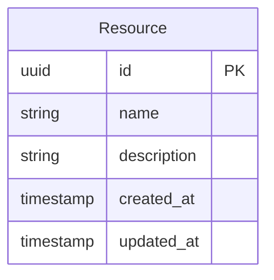

# {{title}} — API Specification

## 1. Overview

### 1.1 Purpose
_Describe the API and its role in the system._

### 1.2 Base URL
`{{base_url:/api/v1}}`

### 1.3 Authentication
All endpoints require authentication via Bearer token unless marked as public.

### 1.4 Rate Limiting
| Tier | Requests/min | Burst |
|------|-------------|-------|
| Standard | 60 | 100 |
| Elevated | 300 | 500 |

---

## 2. Endpoints

### 2.1 `GET {{base_url:/api/v1}}/resource`

**Description**: _What this endpoint does._

**Authorization**: Required

**Query Parameters**:
| Name | Type | Required | Description |
|------|------|----------|-------------|
| `page` | integer | No | Page number (default: 1) |
| `limit` | integer | No | Items per page (default: 20, max: 100) |

**Response (200)**:
```json
{
  "data": [],
  "pagination": {
    "page": 1,
    "limit": 20,
    "total": 0
  }
}
```

### 2.2 `POST {{base_url:/api/v1}}/resource`

**Description**: _What this endpoint creates._

**Authorization**: Required

**Request Body**:
```json
{
  "name": "string (required)",
  "description": "string (optional)"
}
```

**Response (201)**:
```json
{
  "data": { "id": "uuid", "name": "string" },
  "message": "Created successfully"
}
```

---

## 3. Error Handling

### Standard Error Response
```json
{
  "error": {
    "code": "ERROR_CODE",
    "message": "Human-readable message",
    "details": {}
  }
}
```

### Error Codes
| Code | Status | Description |
|------|--------|-------------|
| `VALIDATION_ERROR` | 400 | Request body/params invalid |
| `UNAUTHORIZED` | 401 | Missing or invalid auth token |
| `FORBIDDEN` | 403 | Insufficient permissions |
| `NOT_FOUND` | 404 | Resource not found |
| `RATE_LIMITED` | 429 | Too many requests |
| `INTERNAL_ERROR` | 500 | Unexpected server error |

---

## 4. Data Models



---

## 5. Testing

### 5.1 Test Cases
| ID | Endpoint | Scenario | Expected |
|----|----------|----------|----------|
| TC-1 | GET /resource | Valid request | 200 with data |
| TC-2 | GET /resource | Invalid page | 400 validation error |
| TC-3 | POST /resource | Valid body | 201 created |
| TC-4 | POST /resource | Missing name | 400 validation error |
| TC-5 | Any | No auth token | 401 unauthorized |
