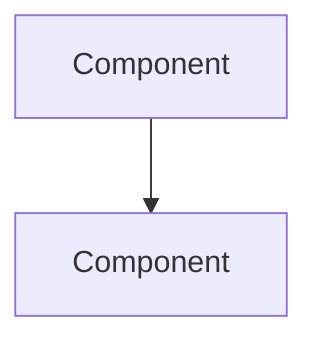

# ADR: {{title}}

**Status**: {{status:proposed}}
**Date**: {{decision_date}}

## Context

_Describe the forces at play, including technological, political, social, and project constraints. These forces are likely in tension and should be called out as such._

## Decision

_Describe the decision that was made. Use active voice: "We will..."_

## Alternatives Considered

### Alternative 1: _Name_
- **Pros**: 
- **Cons**: 
- **Why rejected**: 

### Alternative 2: _Name_
- **Pros**: 
- **Cons**: 
- **Why rejected**: 

## Consequences

### Positive
- _Benefit 1_
- _Benefit 2_

### Negative
- _Tradeoff 1_
- _Tradeoff 2_

### Risks
- _Risk 1 and mitigation_
- _Risk 2 and mitigation_

## Architecture Diagram

## Implementation Notes
_Key implementation details, migration steps, or rollout plan._

## References
- _Link to related ADRs, specs, or external resources_
