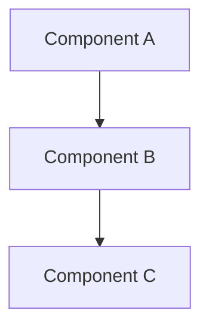

# {{title}}

## 1. Overview

### 1.1 Purpose
_Describe the purpose of this specification._

### 1.2 Scope
_Define what is in scope and out of scope._

### 1.3 Goals
- Goal 1
- Goal 2

### 1.4 Audience
_Who should read this specification._

---

## 2. Requirements

### 2.1 Functional Requirements

**REQ-2.1.1**: _Requirement description_

**REQ-2.1.2**: _Requirement description_

### 2.2 Non-Functional Requirements

**REQ-2.2.1**: _Performance / security / accessibility requirement_

---

## 3. Technical Design

### 3.1 Architecture

### 3.2 Data Model
_Describe entities, relationships, and data flow._

### 3.3 API Contracts
_Define endpoints, request/response schemas._

---

## 4. Implementation Plan

### 4.1 Task Breakdown
| Task | Priority | Effort | Dependencies |
|------|----------|--------|--------------|
| Task 1 | High | M | None |
| Task 2 | High | L | Task 1 |

### 4.2 Milestones
- **Milestone 1**: _Description_
- **Milestone 2**: _Description_

---

## 5. Testing Strategy

### 5.1 Test Plan
_Describe the testing approach._

### 5.2 Acceptance Criteria
- [ ] Criterion 1
- [ ] Criterion 2

---

## Appendix
_Additional references, diagrams, or context._
